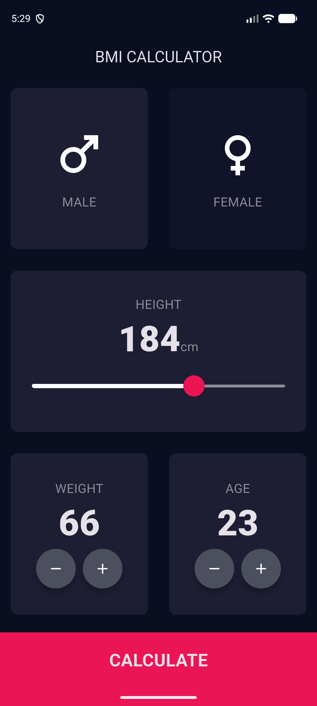

# Lab 8: BMI Calculator

Tính chỉ số khối cơ thể (BMI) từ chiều cao và cân nặng.

## Chức năng

- Chọn giới tính, chỉnh chiều cao bằng `Slider` (120–220 cm), tăng/giảm cân nặng và tuổi.
- `CalculatorBrain` tính BMI = cân nặng / (chiều cao m)², phân loại Normal / Overweight / Underweight và đưa lời khuyên.
- Điều hướng `Navigator.push()` sang `ResultsPage`, `Navigator.pop()` khi nhấn RE-CALCULATE.
- Widget tái sử dụng: `ReusableCard`, `IconContent`, `RoundIconButton`, `BottomButton`.

## Cấu trúc chính

- `lib/main.dart`
- `lib/constants.dart`
- `lib/calculator_brain.dart`
- `lib/components/`
- `lib/screens/`

## Chạy ứng dụng

```bash
flutter pub get
flutter run
```

## Demo


